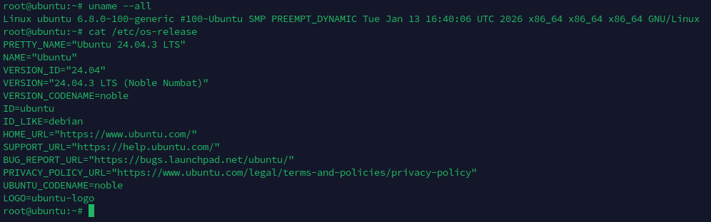

# Bash

BASH-скрипт

## Содержание

- [Bash](#bash)
  - [Содержание](#содержание)
  - [Цель](#цель)
  - [Пошаговая инструкция выполнения домашнего задания](#пошаговая-инструкция-выполнения-домашнего-задания)
    - [Что нужно сделать](#что-нужно-сделать)
    - [Критерии оценки](#критерии-оценки)
  - [Примечание от автора](#примечание-от-автора)
    - [Замечание 1](#замечание-1)
    - [Замечание 2](#замечание-2)
    - [Замечание 3](#замечание-3)
    - [Замечание 4](#замечание-4)
  - [Базовый образ](#базовый-образ)
  - [Выполнение задания и особенности работы скриптов](#выполнение-задания-и-особенности-работы-скриптов)

## Цель

- написать bash-скрипт, который ежечасно формирует и отправляет на email отчёт о работе веб-сервера

## Пошаговая инструкция выполнения домашнего задания

### Что нужно сделать

Написать скрипт для CRON, который раз в час формирует отчёт и отправляет его на заданную почту.

Отчёт должен содержать:

1. IP-адреса с наибольшим числом запросов (с момента последнего запуска);
2. Запрашиваемые URL с наибольшим числом запросов (с момента последнего запуска);
3. Ошибки веб-сервера/приложения (с момента последнего запуска);
4. HTTP-коды ответов с указанием их количества (с момента последнего запуска).

Скрипт должен предотвращать одновременный запуск нескольких копий, до его завершения.

В письме должен быть прописан обрабатываемый временной диапазон.

### Критерии оценки

Трапы и функции, а также `sed` и `find`.

## Примечание от автора

### Замечание 1

Вообще-то подобную генерацию отчета не надо делать через Bash, так как высока вероятность сбоя при парсинге результатов.
Лучше использовать специализированные решения, наподобие Grafana + Loki + Alloy. Или ELK-стек.
Там не только можно провести более доскональный анализ, но и отправить алерт куда угодно.

### Замечание 2

Для анализа, логи в `nginx` нужно выгружать в формате `json`, тогда парсинг будет на порядок легче через `jq`.
Но, так как в критериях оценки указано использование функций `sed` и `find`, то будем парсить стандартный текстовый лог.

### Замечание 3

Отправка через email требует настройки под конкретного провайдера почты. Разные порты и протоколы.
Я буду отталкиваться на основе отправки через Яндекс.Почту с созданным паролем приложения.
Будет использоваться пакет `swak` для отправки.

### Замечание 4

Обычно кроме лога `access.log` nginx имеет файл ошибок `error.log`.
Я не рассматриваю его парсинг, так как придется прописывать сложный анализ в зависимости от вывода данных `info`, `warn` или не дай бог `debug`.

## Базовый образ

Для выполнения текущего задания используется базовый образ `Ubuntu 24.04.3 LTS`.

<table>
<tr><td style="border: 1px solid #777; padding: 10px;">

```bash
root@ubuntu:~# uname --all
Linux ubuntu 6.8.0-100-generic #100-Ubuntu SMP PREEMPT_DYNAMIC Tue Jan 13 16:40:06 UTC 2026 x86_64 x86_64 x86_64 GNU/Linux
root@ubuntu:~# cat /etc/os-release
PRETTY_NAME="Ubuntu 24.04.3 LTS"
NAME="Ubuntu"
VERSION_ID="24.04"
VERSION="24.04.3 LTS (Noble Numbat)"
VERSION_CODENAME=noble
ID=ubuntu
ID_LIKE=debian
HOME_URL="https://www.ubuntu.com/"
SUPPORT_URL="https://help.ubuntu.com/"
BUG_REPORT_URL="https://bugs.launchpad.net/ubuntu/"
PRIVACY_POLICY_URL="https://www.ubuntu.com/legal/terms-and-policies/privacy-policy"
UBUNTU_CODENAME=noble
LOGO=ubuntu-logo
```

<details>
<summary>📸 Скриншот кода...</summary>

</details>

</td></tr>
</table>

## Выполнение задания и особенности работы скриптов

Итоговый скрипт находится в папке `files/report_script.sh`.
Для работы отправки файла отчета на e-mail требуется установкить пакет `swaks`.

```bash
sudo apt-get update && sudo apt-get install -y swaks
```

Также требуется создать пароль приложения для вашей почты на Яндекс.Почте
[https://id.yandex.ru/security/app-passwords](https://id.yandex.ru/security/app-passwords)

> Имейте ввиду, что ограничение 500 писем в день при такой отправке

Переименуйте файл `.env_example` в `.env` и укажите ваш e-mail и пароль приложения.
Этот файл с кредами будет прочитан в момент отправки отчета на почту.

Для тестирования прилагается файл `access.log`. Это тестовый файл лога `nginx` стандартной формы.
Как я уже отметил выше - лучше использовать кастомный формат лога в формате json.
Будет гораздо меньше проблем, но это, впрочем, не тема текущего задания.

При первом запуске скрипта будет создан файл `report_script.sh.ladf`, в который будет записана дата
последней записи последнего обращения к логу. Для тестирования Вы можете записать в него дату из середины лога.
После этого лог будет прочитан от этой записи.

При работе также создается файл `/tmp/report_script.sh.lock`, который предотвращает запуск нескольких инстансов файла.
Также создается файл отчета `/tmp/nginx_report.XXXXXX` (где XXXXXX - произвольный сгенерированый `mktemp` набор символов),
который будет отправлен на email.

После завершения скрипта файлы из /tmp/ удаляются.

Для постановки запуска скрипта в cron отредактируйте конфиг от имени того пользователя, который будет его запускать.

```bash
$ crontab -e

# Каждый час в 0 минут
0 * * * * /root/report_script.sh >> /var/log/report_script.log 2>&1
```
